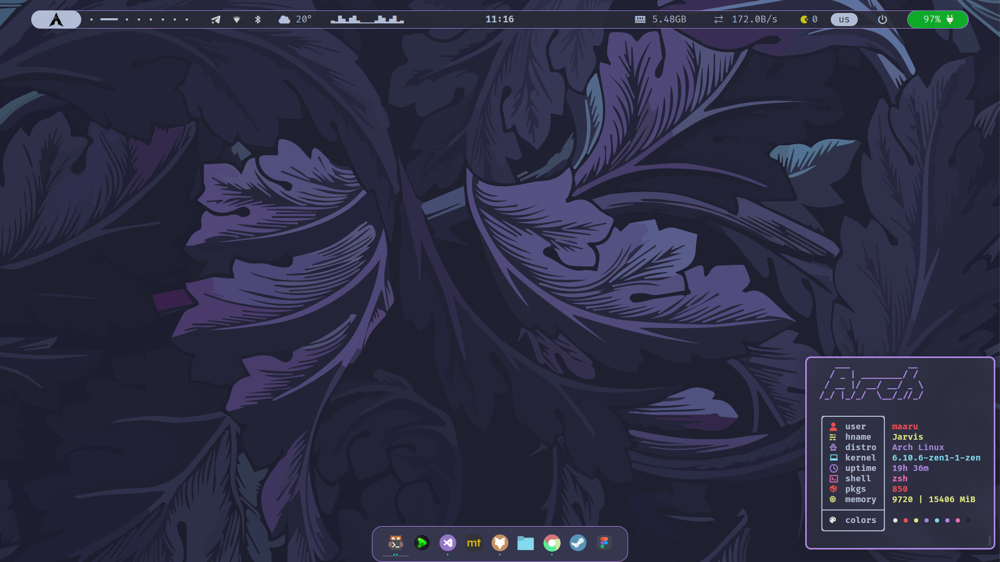

## HyprDots-maaru

1. [install](#install)
2. [sreenshot](#screenshot)

## About a dots

<p>
    hi everyone, this is my configuration based on
    Archlinux + Hyprand
    this build is simple and convenient for working with the keyboard,
    what I use ???
</p>

1. [waybar](https://github.com/Alexays/Waybar)
2. [nwg-dock-hyprland](https://github.com/nwg-piotr/nwg-dock-hyprland)
3. [swww](https://github.com/LGFae/swww) (wallpapers)
4. [rofi](https://github.com/davatorium/rofi) (application launcher)
5. [hyprland](https://github.com/hyprwm/Hyprland) + [wayland](https://github.com/topics/wayland)

<p>
    font: FiraCode nerd fonts
    I use vscode as an editor, I configured it like in neovim
    well, and what's more, I use the dracula theme
    there is no installer yet, I think you'll figure out how to install it yourself ;-;
</p>

## install

Instructions for installing and configuring the project. For example:

```bash
# clone repositories
git clone https://github.com/maarutan/HyprDots-maaru.git

# go to
cd HyprDots-maaru

# install scripts
# still under development
```

## Screenshot




